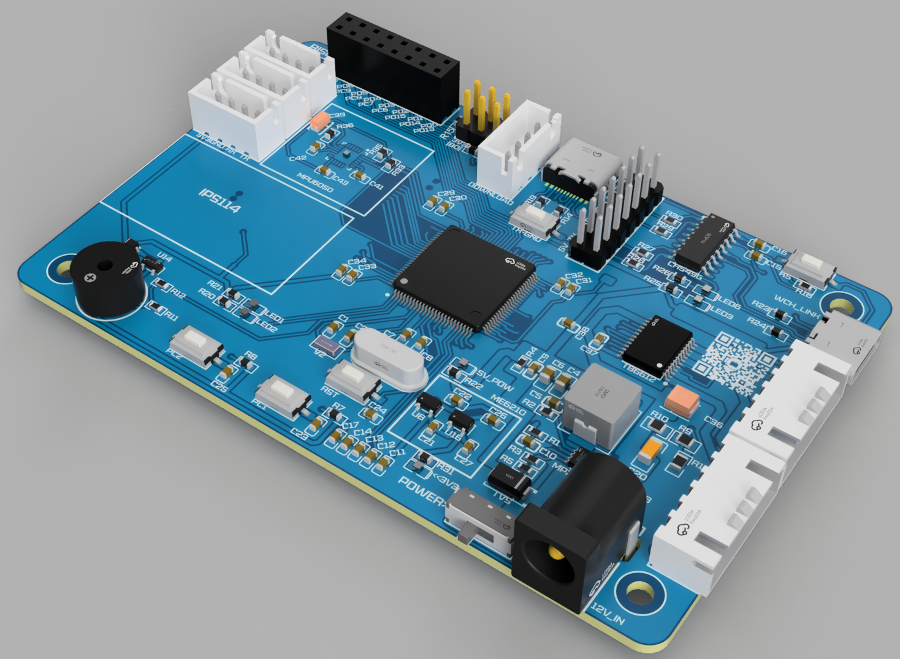
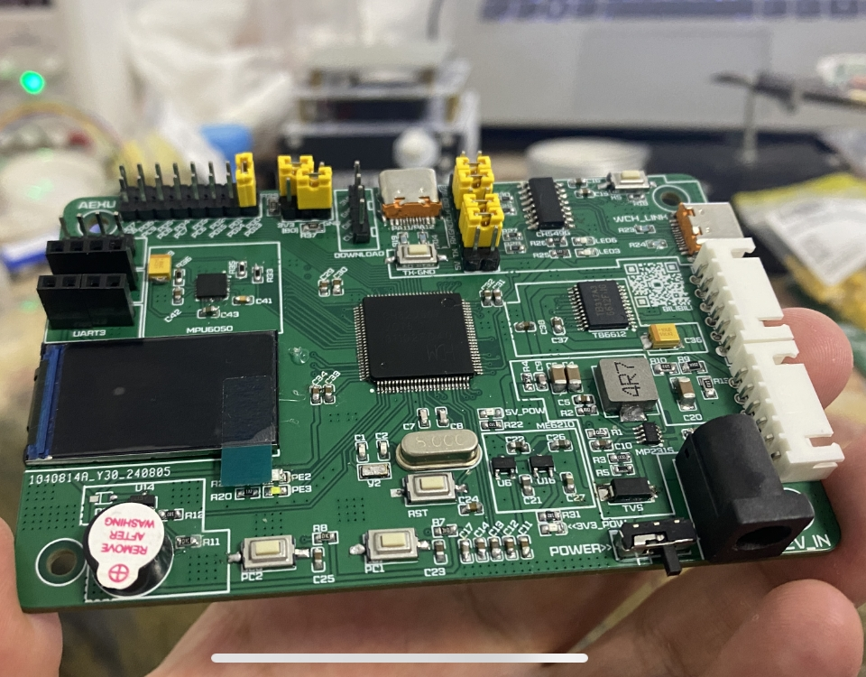

# CH32_DC_BalanceCar
##  自制的平衡小车的开源程序+硬件，某些地方尚不完善。
PID平衡部分计划使用两种方案进行对比  
1 pid_1.c文件 即不通过控制角度来确定速度，通过将直立环PID的目标设为重力0点，来维持平衡，之后通过速度环调速。  
2 pid.c文件 通过控制角度来确定速度，速度环输出目标速度下的应得角度，直立环与速度环串级，直立环负责达到对应角度。  
PCB渲染图：   
   
实物图：   
     
